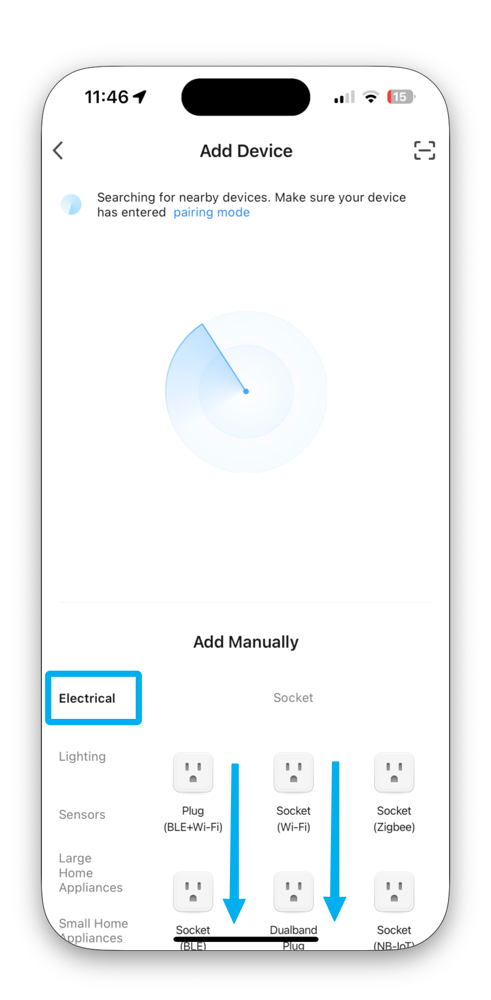
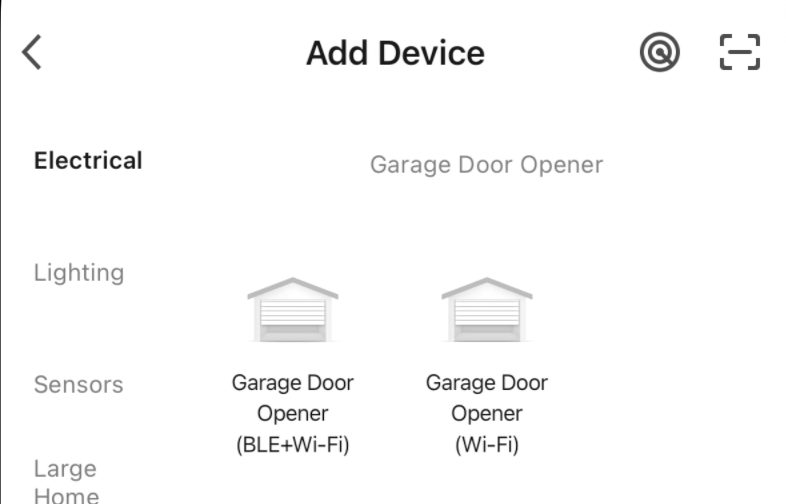

# Garage Door

First pair the device with the app, and then pair the app with Home Assistant or Homebridge.

## App/Pairing Instructions

Use the Smart Life/Tuya Smart app to pair the garage door with the account used in Home Assistant/Homebridge

Scroll down in the main 'Electrical' page and choose 'Garage Door Opener (Wi-Fi)'. 

{ width="150"}
{ width="150"}

To enter pairing mode, press and hold the button on the opener until the LED starts blinking blue quickly. For the alternate pairing mode (blink slowly), hold the button while plugging in the opener. 

Link to Opener:
[Garage Door Opener](https://www.amazon.com/gp/product/B07TCW1WJ1)

# 3D Prints for magnets

There are a few STL files I have made for holding out a magnet to the sensor so that it triggers the open/close sensor accurately. 

[garage 2 magnet extension.stl](../files/3d-prints/garage%202%20magnet%20extension.stl)

[garage2adptr.stl](../files/3d-prints/garage2adptr.stl)

[garagesensorclip v0.stl](../files/3d-prints/garagesensorclip%20v0.stl)

[garagetop.stl](../files/3d-prints/garagetop.stl)