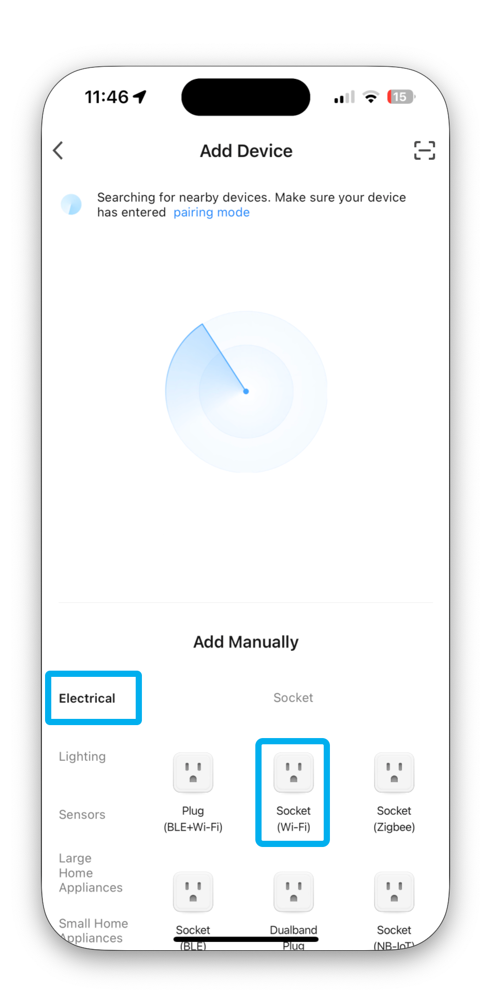

# Smart Plugs

## Types of Smart Plugs

There are many different types of smart plugs, but they all work in a similar way. 

First pair the device with the app, and then pair the app with Home Assistant or Homebridge.

Pair the smart plug with the account used in Home Assistant/Homebridge. 

## Tuya/Smart Life Plugs

Tuya and Smart Life plugs work with both the Smart Life and Tuya Smart apps by Tuya Inc., which share the same backend.

Use either app to pair plugs with your Home Assistant/Homebridge account. Press and hold the button for 

{ width="150"}

Pairing Modes:

** Fast Blinking **

Indicates the plug is in EZ (Easy) Mode, which is the default pairing mode for Tuya devices.

In this mode, the plug quickly searches for a Wi-Fi network and pairs with your app when provided the correct credentials.

Fast blinking usually occurs right after resetting the device (e.g., pressing and holding the button for a certain duration).

** Slow Blinking **

Indicates the plug is in AP (Access Point) Mode, an alternate pairing mode.

In this mode, the plug creates its own Wi-Fi hotspot for manual setup.

You connect to the plug’s hotspot via your phone and provide the Wi-Fi credentials manually in the app.

This mode is often used when EZ Mode fails or the network has compatibility issues (e.g., if the router only supports 2.4 GHz but settings are restrictive).

## Kasa/Tapo Smart Plugs

Similar to Tuya/Smart Life plugs, Kasa Smart Plugs work with both the Kasa Smart and Tapo apps. 

Device Types:
- Kasa Smart: TP-Link's original smart home brand, supporting Kasa-branded devices.
- Tapo: A newer, budget-friendly line, designed mainly for Tapo-branded devices.

Use whichever app is designed for your device, just know that both apps generally share the same backend. 

TP-Link has integrated Kasa device support into the Tapo app, allowing users to control both Kasa and Tapo devices from a single interface.

