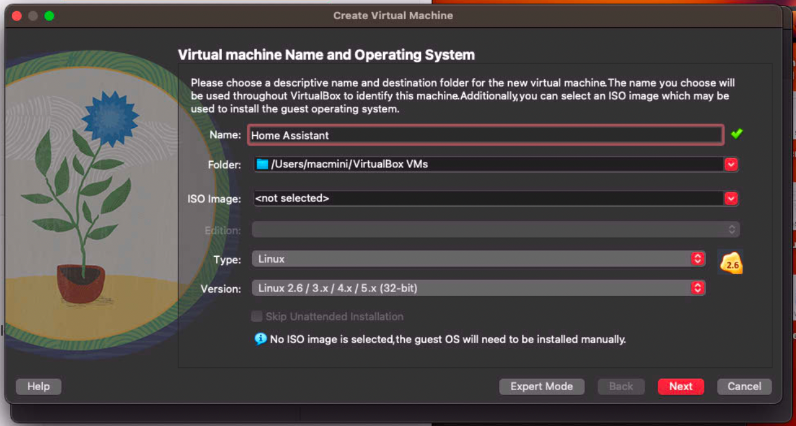
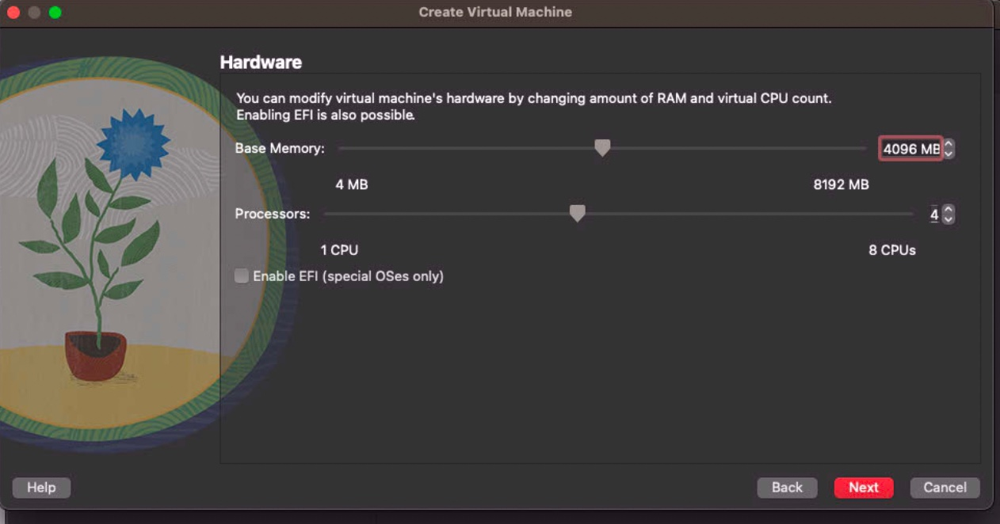
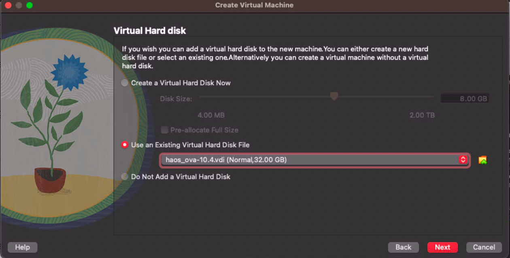

# Home Assistant

!!! warning
    Virtualbox is required to run Home Assistant. The latest version of Virtualbox has a bug when running on macOS 13.3. 

    This bug prevents the Home Assistant VM from booting entirely. A fix is hopefully in the next version. 

    See forum post here: [https://forums.virtualbox.org/viewtopic.php?f=8&t=109003](https://forums.virtualbox.org/viewtopic.php?f=8&t=109003)


## Prerequisites
Virtualbox 
[https://www.virtualbox.org/wiki/Downloads](https://www.virtualbox.org/wiki/Downloads)

Version required: `VirtualBox-7.0.11` 

## Download
Download the latest VDI from [virtualbox.org/wiki/Testbuilds](https://www.virtualbox.org/wiki/Testbuilds)

Latest validated version: `haos_ova-10.4.vdi`

## Install
### Create VM
Create VM as detailed at [home-assistant.io/installation/macos/#hypervisor-specific-configuration](https://www.home-assistant.io/installation/macos/#hypervisor-specific-configuration)

Minimum recommended config:
```
2 GB Memory
32 GB Storage
2vCPU
```

Config I use:
```
4096 MB (4 GB) Memory
4vCPU
```

{ width="400"}
{ width="400"}
{ width="400"}


### Post VM Creation
After creating the VM, configure it. 


- Edit the Settings of the VM and go to `System > Motherboard`. Select `Enable EFI`.
- Then go to `Network > Adapter 1`. Choose `Bridged Adapter` and choose your network adapter.


