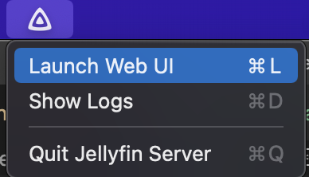
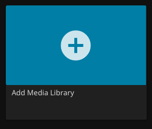

# Jellyfin
!!! info
    Jellyfin is used to serve media content, manage and record live TV content, and more. 

## Installation
Download the latest version of `installer/jellyfin_x.x.x.dmg`from [https://repo.jellyfin.org/releases/server/macos/versions/stable/installer/](https://repo.jellyfin.org/releases/server/macos/versions/stable/installer/)

Open installed file, drag to Applications folder

Click the 
  { width="50"} icon in the menu bar and choose 'Open Menu Bar' <br> { width="200"}

Setup Jellyfin

- Default settings
- Create a primary Admin user

## Configure Libraries
1. Click "Add Media Library"
<br> { width="200"}

2. Choose "Content Type" -> content type of your folder (likely 'Movies' or 'Shows')
3. Click + { width="100"}
4. Add the folder that contains the specified Content Type files
5. Repeat for other libraries

## Live TV Configuration
### Static IP address:

1. Find HDHomeRun MAC address at [http://hdhomerun.local/system.html](http://hdhomerun.local/system.html).

    !!! info
        If this URL is not working, first locate the IP address of HDHomeRun on modem Web UI at [http://192.168.0.1/modemstatus_landevicelist.html](http://192.168.0.1/modemstatus_landevicelist.html) and use the IP Address instead of `hdhomerun.local`

2. In [modem settings](http://192.168.0.1/index.html) -> Advanced Setup -> DHCP Reservation:  
Enter (or choose) the MAC address and set a static IP (whatever IP was already set on the HDHR system menu web page)


### Setup Live TV
Follow the "Manual Setup" directions located at: 
[https://jellyfin.org/docs/general/server/live-tv/setup-guide.html](https://jellyfin.org/docs/general/server/live-tv/setup-guide.html)

To find the IP address of the HDHomeRun, go to the web UI at [http://hdhomerun.local/system.html](http://hdhomerun.local/system.html)

### Add Guide Data
1. Create a folder on the Mac: `/Users/Shared/xmltvdata`
2. Install [Docker Desktop](https://www.docker.com/products/docker-desktop) 

	- Settings -> General -> Start Docker Desktop when you log in
	- Settings -> Resources -> File Sharing: Remove existing mounts and add /Users/Shared/xmltvdata

3. Create a Docker container for the [Zap2XML Docker Container](https://github.com/shuaiscott/zap2xml)

	- Open Docker Desktop app
	- Run terminal command: replace `your_zap2it_email@email.com` and `your_zap2it_password` with your [https://tvlistings.zap2it.com/](https://tvlistings.zap2it.com/) account details. 

	````sh
	docker run -d --name zap2xml -v /Users/Shared/xmltvdata:/data -e USERNAME=your_zap2it_email@email.com -e PASSWORD=your_zap2it_password -e OPT_ARGS="-I -D -Z 55303" -e XMLTV_FILENAME=xmltv.xml shuaiscott/zap2xml
	````

	By default, new guide data will be fetched by this Docker container every 12 hours. Additional command line arguments can be added/changed. See details on GitHub - shuaiscott/zap2xml README.

	!!! info
	    If troubleshooting is required, and the container needs to be added again, ensure the container and images are deleted before recreating using `docker run` command


4. Open the container

    - Cick on on `zap2xml` from the 'Containers' view
    - Click `Logs`
	- Let the Container run. When complete, a status message will print like this:

	````
	Downloaded 1090062 bytes in 291 http requests using 2 sockets.
	Writing XML file: /data/xmltv.xml
	Completed in 167s (Parse: 164s) 81 stations, 7895 programs, 17063 scheduled.
	Last run time: Fri Mar 11 04:12:49 UTC 2022
	Will run in 43200 seconds
	````


5. Verify File
    
	In macOS Finder, verify that a xmltv.xml file was created at location `/Users/Shared/xmltvdata`. File should start with something like:
   
	```xml
	<?xml version="1.0" encoding="UTF-8"?>
	<!DOCTYPE tv SYSTEM "xmltv.dtd">

	<tv source-info-url="http://tvlistings.zap2it.com/" source-info-name="zap2it.com" generator-info-name="zap2xml" generator-info-url="zap2xml@gmail.com">
		<channel id="I2.1.21634.zap2it.com">
			<display-name>2.1 KTCADT</display-name>
			<display-name>2.1</display-name>
			<display-name>KTCADT</display-name>
			<icon src="https://zap2it.tmsimg.com/h3/NowShowing/21634/s32356_h3_aa.png" />
	```

	Scroll down past the `<channel></channel>` sections, and verify that there are `</programme></programme>` tags, with contents similar to

	```xml
	<programme start="20220311023000 +0000" stop="20220311040000 +0000" channel="I2.1.21634.zap2it.com">
			<title lang="en">Endeavour: The Evolution</title>
			<desc lang="en">A look at how …..</desc>
			<category lang="en">Documentary</category>
			<category lang="en">Special</category>
			<length units="minutes">90</length>
			<icon src="https://zap2it.tmsimg.com/assets/p21373423_b_v13_aa.jpg" />
			<url>https://tvlistings.zap2it.com//overview.html?programSeriesId=SH04161006&amp;tmsId=SH041610060000</url>
			<episode-num system="dd_progid">SH04161006.0000</episode-num>
			<previously-shown />
			<subtitles type="teletext" />
	</programme>
	```


6. Once the file looks correct, it can be added into Jellyfin. 

Add the created file to Jellyfin from Administration Dashboard -> Live TV -> TV Guide Data Providers -> XMLTV

See details on [Adding Guide Data - Setup Guide | Documentation - Jellyfin Project](https://jellyfin.org/docs/general/server/live-tv/setup-guide.html#adding-guide-data)


### Post Processing
Jellyfin supports Post Processing of recorded Live TV shows. This can be used to transcode the recording to a specific format that does not require transcoding on the fly when playing back, extract subtitles, remove commercials, and more.

More details on post processing is available on [Live TV Post Processing | Documentation - Jellyfin Project](https://jellyfin.org/docs/general/server/live-tv/post-process.html)

#### Prerequisites 
Install using [Brew](https://brew.sh):

- Python
- Python3
- Pip
- Pip3
- ffmpeg

#### Create Scripts

1. Create Folders:

    - `/Users/Shared/Scripts`
    - `/Users/Shared/Scripts/logs`

2. Create Files:

    - `/Users/Shared/Scripts/run_post_processor.sh`
    - `/Users/Shared/Scripts/record_post_process.py`

3. Edit Scripts:
    Use VSCode or another code editor to add code into these scripts. 

    Copy and paste from GitHub links:

    - [run_post_processor.sh](https://gist.github.com/AndrewBreyen/0fc36c868486d48583a369b657e22c69)
    - [record_post_process.py](https://gist.github.com/AndrewBreyen/1ac109bb485d8523e28fe98b3a222602)

	In `run_post_processor.sh`:
	
	- Change logging directory to /Users/Shared/Scripts
	- Change Python path to the result of `which python3`
	- Change path of `record_post_process.py` to `/Users/Shared/Scripts/record_post_process.py`

    In `record_post_process.py`:
	
	- Change logging directory to `/Users/Shared/Scripts/logs`


4. Make shell script executable -- run in a terminal: 
```` sh
chmod +x /Users/Shared/Scripts/run_post_processor.sh
````

#### Add to Jellyfin

1. In Jellyfin Dashboard/DVR/Recording Post Processing settings:

2. Set "Post-processing application" to your shell script which calls your actual post processor (details of this 'actual' post processor script below). In this example, that would be `/Users/Shared/Scripts/run_post_processor.sh`

3. Set "Post-processor command line arguments" to `{path}`

#### Test Python Script
1. Record a show from the Jellyfin Web UI (this recording can be just a few seconds long)

2. Troubleshoot by viewing logs at `/Users/Shared/Scripts/logs/*`. 