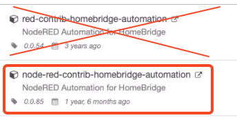
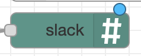
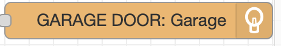

# Node-RED
!!! info
    Node-RED is used to control automations that require more settings/control than HomeKit or HomeBridge can provide natively. 

!!! quote " "
        Node-RED is a programming tool for wiring together hardware devices, APIs and online services in new and interesting ways.  
        
        It provides a browser-based editor that makes it easy to wire together flows using the wide range of nodes in the palette that can be deployed to its runtime in a single-click."

## Installation

<!-- DIRECTIONS FOR DOCKER INSTALL -- unsuccessful -->
<!-- Prerequisites:
- Docker Desktop installed

1. Create folder `/Users/Shared/nodered_data`
2. Add the created folder as a shared resource in Docker settings -> Resources -> File Sharing 
2. In a terminal, run:
    ````
    docker run --restart=always -it -p 1880:1880 -v /Users/Shared/nodered_data:/data --name mynodered nodered/node-red
    ````
3. Once you see a message from the terminal similar to
    ````
    Welcome to Node-RED
    ===================

    2 Oct 23:26:06 - [info] Node-RED version: v3.0.2
    2 Oct 23:26:06 - [info] Node.js  version: v16.16.0
    ...
    2 Oct 23:26:07 - [info] Started flows

    ````
    Node-RED has been successfully installed!
4. Open the web UI at  -->

<!-- LOCAL INSTALL -->

Prerequisites:

- npm installed

1. Open a terminal and run `sudo npm install -g --unsafe-perm node-red`
2. Once you see a message from the terminal similar to
    ````
    Welcome to Node-RED
    ===================

    2 Oct 23:26:06 - [info] Node-RED version: v3.0.2
    2 Oct 23:26:06 - [info] Node.js  version: v16.16.0
    ...
    2 Oct 23:26:07 - [info] Started flows

    ````
    Node-RED has been successfully installed!
3. Exit Node-RED by pressing ++ctrl++ + ++c++ (will be restarted later using pm2 to run in the background)

More information available at: [https://nodered.org/docs/getting-started/local](https://nodered.org/docs/getting-started/local)


## Enabling Node-RED to start on computer boot

1. Install PM2: In a terminal, run: `sudo npm install -g pm2`
2. Determine the exact location of the `node-red` command: run `which node-red` in a terminal
3. Tell PM2 to run Node-Red: run `pm2 start /path/to/node-red -- -v` in a terminal, replacing `/path/to/node-red` with the result of `which node-red` from above
4. Temm PM2 to run on boot: Run these commands in a terminal, and follow the instructions provided
- `pm2 save`
- `pm2 startup`
5. Reboot the machine, and verify that PM2 has started NodeRED 

More information: [https://nodered.org/docs/faq/starting-node-red-on-boot](https://nodered.org/docs/faq/starting-node-red-on-boot)

## Additional Palette items
Once Node-RED is running and you can access via a web browser, install these additional items by clicking the three lines hamburger button in the top right, and selecting ‘Manage Palette’, then move to the ‘Install’ tab

- node-red
- node-red-contrib-cron
- node-red-contrib-homebridge-automation

!!! note
    Ensure the correct Palette item is chosen -- there are two versions available

    { width="200"}

- node-red-contrib-slack-files
- node-red-contrib-stoptimer

## Importing Flows
1. Go to [https://github.com/AndrewBreyen/Node-RED-flows/](https://github.com/AndrewBreyen/Node-RED-flows/) and pick which flow you want to start importing
2. Copy the contents of desired flows’ (use the {: style="height:30px;width:25px"} button for ease of use)
3. Click the three lines hamburger button in the top right, and selecting ‘Import’
4. Paste in value copied to clipboard
5. Go to [https://api.slack.com/apps/A03JPNEBPC4/incoming-webhooks](https://api.slack.com/apps/A03JPNEBPC4/incoming-webhooks) to retrieve the Webhook URL, copy to clipboard
6. Double click on the {: style="height:40px;width:100px"} node(s)
7. Paste in the Webhook URL copied to clipboard
8. Double click on the {: style="height:40px;width:200px"} and {: style="height:40px;width:200px"}nodes, ensure that the correct device and Homebridge Pin are selected
9. Repeat with the other flows you want to import
10. Test it out!
