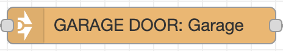

# Node-RED
Node-RED is used to control automations that require more settings/control than HomeKit or HomeBridge can provide natively. 

!!! quote " "
        Node-RED is a programming tool for wiring together hardware devices, APIs and online services in new and interesting ways.  
        
        It provides a browser-based editor that makes it easy to wire together flows using the wide range of nodes in the palette that can be deployed to its runtime in a single-click."

## Installation
Install Node-RED locally using directions provided here: [https://nodered.org/docs/getting-started/local](https://nodered.org/docs/getting-started/local)

## Additional Palette items
Once Node-RED is running and you can access via a web browser, install these additional items by clicking the three lines hamburger button in the top right, and selecting ‘Manage Palette’, then move to the ‘Install’ tab

- node-red
- node-red-contrib-cron
- node-red-contrib-homebridge-automation
- node-red-contrib-slack-files
- node-red-contrib-stoptimer

## Enabling Node-RED to start on computer boot
Follow directions here to use pm2 to have Node-RED start on boot: [https://nodered.org/docs/faq/starting-node-red-on-boot](https://nodered.org/docs/faq/starting-node-red-on-boot)

## Importing Flows
1. Go to https://github.com/AndrewBreyen/Node-RED-flows/ and pick which flow you want to start importing
2. Copy the contents of desired flows’ (use the {: style="height:30px;width:25px"} button for ease of use)
3. Click the three lines hamburger button in the top right, and selecting ‘Import’
4. Paste in value copied to clipboard
5. Go to [https://api.slack.com/apps/A03JPNEBPC4/incoming-webhooks](https://api.slack.com/apps/A03JPNEBPC4/incoming-webhooks) to retrieve the Webhook URL, copy to clipboard
6. Double click on the {: style="height:40px;width:100px"} node(s)
7. Paste in the Webhook URL copied to clipboard
8. Double click on the {: style="height:40px;width:200px"} and {: style="height:40px;width:200px"}nodes, ensure that the correct device and Homebridge Pin are selected
9. Repeat with the other flows you want to import
10. Test it out!
