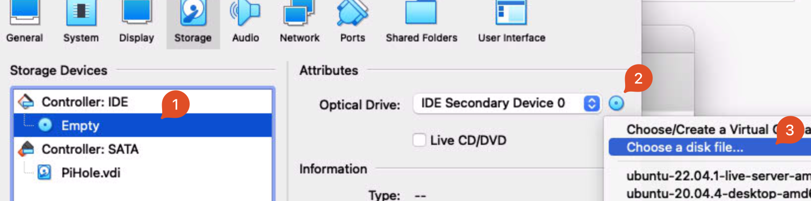

# Pihole
!!! info
    Pihole is used as a network wide Ad blocker using DNS.


!!! note
    There are two ways to install PiHole.

    - If installing from scratch, go to [Set Up From Scratch](#set-up-from-scratch) section
    - If installing from a precreated .OVA Virtual Machine file, go to the [Set Up From Virtual Machine File](#set-up-from-virtual-machine-file) section

## Set Up From Scratch

!!! note 
    Use these directions if setting up from scratch

### Download ISO/Install VirtualBox
Download and install the latest version of VirtualBox from [https://www.virtualbox.org/wiki/Downloads](https://www.virtualbox.org/wiki/Downloads)

Download ISO of LTS edition from [https://ubuntu.com/download/server](https://ubuntu.com/download/server)

### Create a Virtualbox VM
Open Virtualbox and click 'New':
{ width="40"}

Enter these settings:

(these are purposefully low-powered settings, it’s designed for a Raspberry Pi, so a powerful VM is not needed)

**Name and Operating System:**

- Name: `PiHole`
- Machine Folder: `/Users/macmini/VirtualBox VMs`
- Type: `Linux`
- Version: `Ubuntu (64-bit)`

**Memory Size:**

-  `1 GB`

**Hard Disk:**

- Create a virtual hard disk now
- VDI (VirtualBox Disk Image)
- Dynamically Allocated
- Location: `/Users/macmini/VirtualBox VMs/PiHole/PiHole.vdi`
- Size: `10 GB`


### Change VM Settings

Once the VM has been created, click 'Settings', and make changes:

**Network Tab:**

- Enable Network Adapter
- Attatched to: `Bridged`
- Name: `en0: Ethernet`
- Open Advanced Tab, leave all settings to default, but note the MAC address to use to set a static IP

**System Tab -> Processor:**

- CPU Execution cap: `50%`

**Storage Tab -> Controller: IDE**

- Click on 'Empty' under `Controller: IDE`, then click the circle CD icon, and pick ‘choose a disk file…’ <br>
  { width="400"}
- Pick the downloaded ISO
- Click OK

### Set IP Address Reservation
- Open the eero app
- Go to Settings -> Network Settings -> Reservations and Port Forwarding
- Pick 'Add a reservation'
- Scroll to the bottom of the list, and choose 'Enter manually'
- Enter an IP Address to use. For convienence, use a low-number IP address (192.168.4.4)
!!! note 
    The IP address spreified must not be already in use, and must be within the subnet range.
    
    Keep the first three groups of numbers the same, and only change the last group. (eg 192.168.4.##)
- Enter the MAC Address noted previously from the network tab, using format `XX:XX:XX:XX:XX:XX`
- Click 'Save'

### Start Up
- Start VM in headless mode (click arrow next to start -> headless mode) <br>
  { width="75"}
- Click 'Show'

### Install Ubuntu Server
- On first boot, press ++return++ when 'Try or Install Ubuntu Server' is selected, or wait 30 seconds.
- Once booted, continue through setup, applying settings:
    - English
    - US Keyboard
    - Choose type of install: Ubuntu Server
    - Network Connections: Check if the IP address listed matches the one set in the eero app. If it does, continue. If it does not, ensure that the MAC address in eero settings matches the MAC address on screen. Reboot the VM (Machine -> Reset) and try again.
    - Configure proxy: leave blank
    - Configure Ubuntu archive mirror: leave default
    - Guided storage configuration: Leave default - 'Use an entire disk'
    - Storage configuration: leave default
    - Confirm destructive action: continue (NOTE -- ONLY THE VIRTUAL HARD DISK will be modified/erased.)
    - Profile setup: name, servers name, username: set all to 'pihole'. Set a password here.
    - SSH Setup: Install OpenSSH Server
    - Featured Server Snaps: leave all unchecked, continue
- Wait for install to complete. Once 'Install complete!' is shown, choose 'Reboot Now'

An error message will likely show: 
````
Please remove the installation medium, then press ENTER:
Unmounting/cdrom.
[FAILED] Failed unmounting /cdrom.
````

To resolve:

- Close the window, choose 'Power off machine' and then 'Ok'
- This likely was all that is needed, but to double check, go back into Settings -> Storage -> IDE controller. It should be 'Empty' If not, click the CD icon, choose 'Remove Disk from Virtual Drive'
- Start the VM again in headless mode, and choose Show

Once you see 
````
Ubuntu 22.04.1 LTS pihole tty1
pihole login: (may be way more text here)
````
press enter a few times if there is lots of extra text (or don't, it doesn't matter), and login by typing username/password specified. Text or dots will not be shown while typing password.
````
pihole login: pihole
Password:
````
Once you see a prompt
````
pihole@pihole:~$
````
Ubuntu is up and running!

??? note "Optional: SSH Access (may be easier to perform the following steps)"
    
    Once Ubuntu Server is up and running, it may be easier to do the following steps utilizing SSH.

    This will allow for things like copy and paste to work, which will be handy, but not strictly required. 

    To SSH to the VM:

    -  Open a Terminal -- either on MacServer, or on a different laptop
    -  Enter `ssh pihole@ipaddress, replacing 'ipaddress' with the static IP set in the eero app
    -  Enter the user password, and once you see `pihole@pihole:~$`, you're SSHed in! This is the same as if you were using the VM through VirtualBox.

    See the [Updating PiHole via SSH](#via-ssh) section for more details on SSH.


### Set the VM to auto-login
[https://askubuntu.com/a/819154](https://askubuntu.com/a/819154)

1. RUN in terminal of PiHole VM:

    ``` sh
    sudo systemctl edit getty@tty1.service
    ```

2. Edit the file that is generated with these contents, change username to username of VM user (`pihole` in this case):

    ``` yaml
    [Service]
    ExecStart=
    ExecStart=-/sbin/agetty --noissue --autologin pihole %I $TERM
    Type=idle
    ```

3. Save with ++ctrl+x++, ++y++, ++enter++
4. Reboot machine (command: `reboot`) and see if it auto-logs in as Pihole user.

<!---
*****
***** THIS SECTION NO LONGER NEEDED, IP ADDRESS IS SET VIA EERO, INSTEAD OF VIA SUBIQUITY
*****

### Verify IP address
1. Set static IP on Modem via MAC address
(MAC address listed under `$[ip addr]`)

2. RUN in terminal of PiHole VM:
``` sh
sudo nano /etc/netplan/00-installer-config.yaml
```

3.  Copy these contents into the file that is generated, change IP address as needed                                      

    ``` yaml
    # This is the network config written by 'subiquity'
    network:
      version: 2
      ethernets:
        enp0s3:
          addresses:
            - **IP ADDRESS SET ON MODEM**/24
          gateway4: 10.0.1.1
          nameservers:
            addresses:
              - 10.0.1.53
              - 8.8.4.4
    ```

4. RUN in terminal of PiHole VM:
``` sh
sudo netplan generate
```
``` sh
sudo netplan apply
```
``` sh
reboot
```
--->

### Install PiHole
- RUN in terminal of PiHole VM:
``` sh
curl -sSL https://install.pi-hole.net | bash
```
More details on installation can be found at [https://github.com/pi-hole/pi-hole/#curl--ssl-httpsinstallpi-holenet--bash](https://github.com/pi-hole/pi-hole/#curl--ssl-httpsinstallpi-holenet--bash)
- When you get to the blue "GUI" screen:
    - Majorly accept default settings. Read through and change as you wish.
    - When prompted for 'Upstream DNS Provider;, select which one you want. They all pretty much do the same thing. Recommendation: OpenDNS
    - Install the suggested block lists (usually 'StevenBlack's Unified Hosts List' is the default)
    - Install the Admin Web Interface, lighttpd and required PHP modules
    - Enable Query logging if you wish
- Once installation is complete, note the 'Admin Webpage Login Password' -- The password cannot be retrieved later on, but it is possible to set a new password (or explicitly disable the password by setting an empty password)

<!---
*****
***** These directions were for when modem was handling DHCP, this has been shifted to the eeros
*****
1. Open modem web UI [192.168.0.1](192.168.0.1/)
2. Advanced Setup -> DHCP Settings -> 5. Set the DNS servers allocated with DHCP requests
3. Change radio button to `Custom Servers`
4. Enter VM IP address as 'Primary DNS', and Open DNS backup server (8.8.4.4) as 'Secondary DNS'
    
    { width="500"}

5. Click `Apply`
--->

### Finalize Setup
Regardless if setting up PiHole from scratch, or from a Virtual Machine File, some final configuration/verification is required. 

Continue to [Set the VM to auto-launch in headless mode on Mac login](#set-the-vm-to-auto-launch-in-headless-mode-on-mac-login)


## Set Up From Virtual Machine File

!!! note 
    Use these directions if setting up PiHole from a Virtual Machine .OVA file

### Virtualbox Installation and Importing Applicance
1. Download and install Virtualbox from [https://www.virtualbox.org](https://www.virtualbox.org)
2. Download OVA file from [OneDrive](https://1drv.ms/u/s!Ai9VHivOqpbhjzuzVWtlc2ctYijh?e=QS0j5c)

    (Access to this link is restricted -- please confirm if you have access)

3. Open Virtualbox and click 'Import'
{ width="40"}
4. Click the folder icon next to the 'File' box and pick the .OVA file
5. Click 'Continue'
6. Appliance Settings: Change 'MAC Address Policy' to Include all network adapter MAC addresses. Leave all other settings the same. Click 'Import'

### Verify Settings
1. Once the Applicance is imported, verify that the settings match the ones [outlined above](#change-vm-settings)
2. Ensure the correct IP address is reserved in the eero app. Details [outlined above](#set-ip-address-reservation)

### Start Up
1. Start VM in headless mode (click arrow next to start -> headless mode) <br>
  { width="75"}
2. Click 'Show'

### Verify Connectivity
1. Verify internet connectivity by entering command `ping google.com`. If you see a response similar to:
    ````
    64 bytes from 142.250.191.238: icmp_seq=93 ttl=57 time=42.931 ms
    ````
    the VM can reach the internet.
    
    Press ++ctrl++ + ++c++ to exit.

2. Verify IP Address by entering command `ip addr`. Look at the result for the `inet 192.168.4.x` line. It should be the IP address specified in the eero reservation. 
    ```` hl_lines="5"
    1: lo: <LOOPBACK,UP,LOWER_UP> mtu 65536 qdisc noqueue state UNKNOWN group default qlen 1000
    ....
    2: enp0s3: <BROADCAST,MULTICAST,UP,LOWER_UP> mtu 1500 qdisc fq_codel state UP group default qlen 1000
    link/ether 08:00:27:1a:f8:19 brd ff:ff:ff:ff:ff:ff
    inet 192.168.4.4/22 metric 100 brd 192.168.7.255 scope global dynamic enp0s3
       valid_lft 14039sec preferred_lft 14039sec
    ....
    ````

### Finalize Setup
Regardless if setting up PiHole from scratch, or from a Virtual Machine File, some final configuration/verification is required. 

Continue to [Set the VM to auto-launch in headless mode on Mac login](#set-the-vm-to-auto-launch-in-headless-mode-on-mac-login)


## Set the VM to auto-launch in headless mode on Mac login

Download the script vboxlaunchagent.sh from 
[https://www.whatroute.net/software/vboxlaunchagent.sh.zip](https://www.whatroute.net/software/vboxlaunchagent.sh.zip)

Move the downloaded file somewhere convenient, like the Desktop. 

!!! quote "whatroute.net"
    LaunchAgents are configured with an Apple plist XML file installed in the users Library/LaunchAgents folder. When the user logs in to their account on the Mac, launchd will inspect these plist files and invoke the required program with specified arguments.

    It can get a bit tricky to create a plist manually. They have very fussy and very unforgiving syntax requirements. This shell script will create the plist and install it in the LaunchAgents directory.

    You can download the script from vboxlaunchagent.sh. Unzip the file and copy the script to a suitable directory on your machine.


Run the script using this syntax:

1. Find the name of the VM: In a terminal on MacServer directly (not the VM), run:
   ```sh
   VBoxManage list vms
   ```
    
    Should result in output similar to:  
    ```sh 
    macmini@macserver ~ % VBoxManage list vms
    "Pihole" {c7ac734f-3fc7-4645-997b-3c78ef32d8f4}
    ```

    In this example, Pihole is the name of the VM.

2. In a terminal, run
   ```sh
   sh path/to/vboxlaunchagent.sh --headless --verbose "VMName"
   ```
   replacing `VMName` with the name of the VM from the previous step, and `/path/to/vboxlaunchagent.sh` with the full path (likely will be `~/Downloads/vboxlaunchagent.sh` if you just clicked the link above)

3. Ensure that the output is similar to
    ````
    VirtualBox VM found. . . : PiHole
    Created temporary file . : /tmp/org.virtualbox.launch.PiHole
    Created Launch Agent . . : /Users/macmini/Library/LaunchAgents/org.virtualbox.launch.PiHole.plist
    ````

4. Reboot the Mac and ensure the VM auto-starts on login

(Script and explanation from [https://www.whatroute.net/installerapp2iso.html](https://www.whatroute.net/installerapp2iso.html))


## Configure PiHole
- Remove or change admin web page password: RUN in terminal of PiHole VM:
``` sh
sudo pihole -a -p
```
- Open the Web UI (http://your.static.ip.address/admin)
- Configure as you wish

## Set DHCP Server
1. Open the eero app
2. Go to Settings -> Network Settings -> DNS
3. Set to 'Custom'
4. Set 'IPv4 Primary' to the static IP address of PiHole
5. Set 'IPv4 Secondary' to a backup DNS provider to use.
   
??? info "Available Providers"
    Usually it's a good idea to use the same DNS provider that you selected during PiHole setup. However, this is not required.

    Some available providers:

    - OpenDNS: 208.67.222.222
    - Google: 8.8.8.8
    - CloudFlare: 1.1.1.1

!!! warning   
    You can choose to not supply a secondary provider to force PiHole to be used exclusively.

    However, if a secondary DNS provider is not set, if PiHole is down or unavailable to reqpond to queries, DNS queries will not be able to be resolved, resulting in no internet access. 

<br><br>

Once the DNS server is set, Congrats! Pihole is now in use for all devices on the network.
You can test PiHole by visiting a website that previously had ads, they should be blocked now :)


## Troubleshooting Sites not Loading
Pihole is a tracking and ad-blocker. Because of this, some sites may not load, or be missing content. 

### Temporarily Disable Pihole
If this is a one-off thing that you need to load, you can temporarily disable Pihole across the whole network. 

1. Open the [PiHole Web UI](http://192.168.4.4/admin)
2. Click 'Disable'
3. Choose an amount of time to disable. 5 minutes is usually sufficent. 

PiHole is now disabled, and will be automatically re-enabled once the time elapses.

### Add a site to the whitelist

1. Open the [PiHole Web UI](http://192.168.4.4/admin)
2. Click 'Whitelist'
3. Type the domain where you are encountering issues in the 'Domain' field. 
    
    Add any comments as needed

4. Check the 'Add domain as wildcard' box
5. Click 'Add to Whitelist'

### Use the Audit Log
Audit Log will show the top allowed and blocked queries with quick access to blacklist or whitelist them

1. Open the [PiHole Web UI](http://192.168.0.4/admin)
2. Click 'Tools' -> 'Audit Log'


## Updating Pihole (Pihole and underlying Ubuntu OS)
If you see red text at the bottom of the PiHole web UI ‘Update Available’, it needs an update. This is currently a manual process, work in progress to automate it. There are two options, both do exactly the same thing. The SSH option may be easier. 

### Via SSH
#### Pihole Updates
1. Open a Terminal and enter command: `ssh pihole@pi.hole`  
    If you get a message similar to:  
    ```
    The authenticity of host 'pi.hole (192.168.0.4)' can't be established.
    ED25519 key fingerprint is SHA256:jWxxjslC9ObhMty4d0UNERghKP6UWmetfEj80CKW6QY.
    This host key is known by the following other names/addresses:
        ~/.ssh/known_hosts:8: 192.168.0.4
    Are you sure you want to continue connecting (yes/no/[fingerprint])?
    ```

    This is likely because you have not connected to the PiHole VM using SSH previously, and your computer cannot verify the authenticity of the server computer.
    
    Verify the IP address is what you expect (in this example, `192.168.0.4`) and if it’s correct, type `yes` at the prompt. 

    After you have sone this once, you likely will not have to do it again, unless the fingerprint key changes. 

2. At the prompt `pihole@pi.hole's password:` enter the PiHole user password. Once successfully connected, you should see a prompt similar to `pihole@pihole:~$`. You are now SSHed into the PiHole VM!

3. Run command
   ```
   pihole -up
   ```  
4. If prompted `[sudo] password for pihole:`  enter the PiHole user password  
5. Wait for it to update. On success, you should see   `[✓] Everything is up to date!`


#### Ubuntu Updates
It’s also a good idea to update the underlying Ubuntu instance periodically, especially if there is a notice then you logged into the Pihole VM similar to: 
```
91 updates can be applied immediately.
9 of these updates are standard security updates.
```

To do this:

1. Run `sudo apt upgrade`
2. You may be prompted:
```
After this operation, 430 MB of additional disk space will be used.
Do you want to continue? [Y/n]
```
Enter ++y++

1. Wait for it to update. This may take a while, depending on the number of updates.


### Via Apple Remote Desktop
#### Pihole Updates
1. Open Apple Remote Desktop
2. Select `MacServer` from All Computers
3. Click on `Control` or from the taskbar, or choose `Interact > Control` 
4. A new window will open with the MacServer display. 
5. From the Dock, Applications Folder or Spotlight, open `VirtualBox`
6. Ensure `Pihole` is selected in the sidebar  
    { width="200" }
7. Click `Show` { width="40" }
8. A new window will open with the PiHole VM. 
9.  In that new window, ensure you have a `pihole@pihole:~$` prompt. If you do not, press ++enter++ a few times to get to a new line. 
10. Run command
    ``` sh
    pihole -up
    ```
11. If prompted `[sudo] password for pihole:`  enter the PiHole user password
12. Wait for it to update. On success, you should see   `[✓] Everything is up to date!`

#### Ubuntu Updates
It’s also a good idea to update the underlying Ubuntu instance periodically, especially if there is a notice then you logged into the Pihole VM similar to: 
```
91 updates can be applied immediately.
9 of these updates are standard security updates.
```

To do this:

1. Run 
   ``` sh
   sudo apt upgrade
   ```
2. You may be prompted:
```
After this operation, 430 MB of additional disk space will be used.
Do you want to continue? [Y/n]
```
Enter ++y++

3. Wait for it to update. This may take a while, depending on the number of updates.
