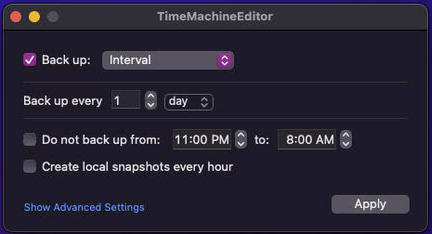
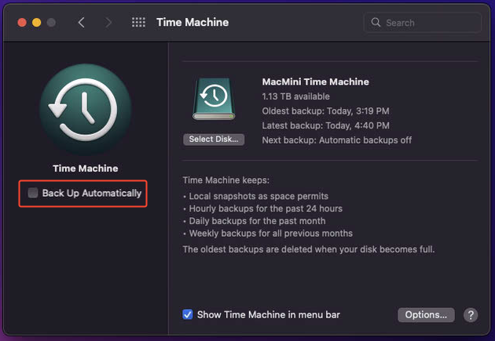

# Time Machine Editor

!!! info
    Time Machine Editor is used to modify the backup frequency of Time Machine Backups

    This allows for space savings, as hourly snapshots are not saved, as well as performance benefits as a backup is not being created hourly.

Hourly backups are likely overkill for MacServer, so this is changed using Time Machine Editor. 

Download and install from [https://tclementdev.com/timemachineeditor/](https://tclementdev.com/timemachineeditor/)

Open the installed application from the Applications Folder and change backup frequency. 

Currently, this is set to backup on an interval of every 1 day.

{ width="300"}

To allow these settings to take effect, instead of the default macOS settings, ensure that 'Back Up Automatically' checkbox in System Prefrences -> Time Machine is disabled. 

{ width="300"}