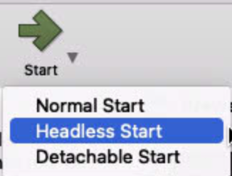

# Create VM

## Download ISO/Install VirtualBox
Download and install the latest version of VirtualBox from [https://www.virtualbox.org/wiki/Downloads](https://www.virtualbox.org/wiki/Downloads)

Download ISO of LTS edition from [https://ubuntu.com/download/server](https://ubuntu.com/download/server)

## Create a Virtualbox VM
Open Virtualbox and click 'New':
{ width="40"}

Enter these settings:

(these are purposefully low-powered settings, it’s designed for a Raspberry Pi, so a powerful VM is not needed)

**Virtual machine Name and Operating System**

- Name: `VMName` (probably `pihole`)
- Machine Folder: `/Users/macmini/VirtualBox VMs`
- Type: `Linux`
- Version: `Ubuntu (64-bit)`

- Check 'Skip unattended installation' 

**Hardware:**

- Base Memory: `1.5 GB (1536 MB)` 
- Processors: `1`

**Virtual Hard Disk:**

- Create a virtual hard disk now
- VDI (VirtualBox Disk Image)
- Dynamically Allocated
- Location: `/Users/macmini/VirtualBox VMs/VMName/VMName.vdi`
- Size: `10 GB`


## Change VM Settings

Once the VM has been created, click 'Settings', and make changes:

**Network Tab:**

- Enable Network Adapter
- Attatched to: `Bridged`
- Name: `en0: Ethernet`
- Open Advanced Tab, leave all settings to default, but note the MAC address to use to set a static IP


**Storage Tab -> Controller: IDE**

- Click on 'Empty' under `Controller: IDE`, then click the circle CD icon, and pick ‘choose a disk file…’ <br>
  { width="400"}
- Pick the downloaded ISO
- Click OK

## Set IP Address Reservation
- Open the eero app
- Go to Settings -> Network Settings -> Reservations and Port Forwarding
- Pick 'Add a reservation'
- Scroll to the bottom of the list, and choose 'Enter manually'
- Enter an IP Address to use. For convienence, use a low-number IP address (192.168.4.4)
!!! note 
    The IP address spreified must not be already in use, and must be within the subnet range.
    
    Keep the first three groups of numbers the same, and only change the last group. (eg 192.168.4.##)
- Enter the MAC Address noted previously from the network tab, using format `XX:XX:XX:XX:XX:XX`
- Click 'Save'

## Start Up
- Start VM in headless mode (click arrow next to start -> headless mode) <br>
  { width="75"}
- Click 'Show'
- Accept/Allow all macOS prompts (accessibility, screen recording, etc)

## Install Ubuntu Server
- On first boot, press ++return++ when 'Try or Install Ubuntu Server' is selected, or wait 30 seconds.
- Once booted, continue through setup, applying settings:
    - English
    - If prompted to update to latest version, update to latest version
    - US Keyboard
    - Choose type of install: Ubuntu Server
    - Network Connections: Check if the IP address listed matches the one set in the eero app. If it does, continue. If it does not, ensure that the MAC address in eero settings matches the MAC address on screen. Reboot the VM (Machine -> Reset) and try again.
    - Configure proxy: leave blank
    - Configure Ubuntu archive mirror: leave default
    - Guided storage configuration: Leave default - 'Use an entire disk'
    - Storage configuration: leave default
    - Confirm destructive action: continue (NOTE -- ONLY THE VIRTUAL HARD DISK will be modified/erased.)
    - Profile setup: name, servers name, username: set all to 'pihole'. Set a password here.
    - SSH Setup: Install OpenSSH Server
    - Featured Server Snaps: leave all unchecked, continue
- Wait for install to complete. Once 'Install complete!' is shown, choose 'Reboot Now'

An error message will likely show: 
````
Please remove the installation medium, then press ENTER:
Unmounting/cdrom.
[FAILED] Failed unmounting /cdrom.
````

To resolve:

- Close the window, choose 'Power off machine' and then 'Ok'
- This likely was all that is needed, but to double check, go back into Settings -> Storage -> IDE controller. It should be 'Empty' If not, click the CD icon, choose 'Remove Disk from Virtual Drive'
- Start the VM again in headless mode, and choose Show

Once you see 
````
Ubuntu 22.04.1 LTS pihole tty1
VMName login: (may be way more text here)
````
press enter a few times if there is lots of extra text (or don't, it doesn't matter), and login by typing username/password specified. Text or dots will not be shown while typing password.
````
VMName login: VMUsername
Password:
````
Once you see a prompt
````
VMUsername@VMName:~$
````
Ubuntu is up and running!

??? note "Optional: SSH Access (may be easier to perform the following steps)"
    
    Once Ubuntu Server is up and running, it may be easier to do the following steps utilizing SSH.

    This will allow for things like copy and paste to work, which will be handy, but not strictly required. 

    To SSH to the VM:

    -  Open a Terminal -- either on MacServer, or on a different laptop
    -  Enter `ssh VMUsername@VMIPAddress, replacing 'VMIPAddress' with the static IP set in the eero app
    -  Enter the user password, and once you see `VMUsername@VMIPAddress:~$`, you're SSHed in! This is the same as if you were using the VM through VirtualBox.

    See the [Updating PiHole via SSH](#via-ssh) section for more details on SSH.


## Set the VM to auto-login
[https://askubuntu.com/a/819154](https://askubuntu.com/a/819154)

1. RUN in terminal of PiHole VM:

    ``` sh
    sudo systemctl edit getty@tty1.service
    ```

2. Edit the file that is generated with these contents, change username to username of VM user (`VMUsername` in this case):

    ``` yaml
    [Service]
    ExecStart=
    ExecStart=-/sbin/agetty --noissue --autologin VMUsername %I $TERM
    Type=idle
    ```

3. Save with ++ctrl+x++, ++y++, ++enter++
4. Reboot machine (command: `reboot`) and see if it auto-logs in as Pihole user.