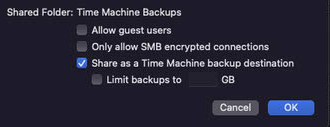

# macOS Settings

Make these changes in macOS System Preferences

## Users and Groups
### Login Options 
Enable automatic login for the MacMini user

### macmini -> Login Items
Automatically start apps on MacMini user login

  - Docker
  - Jellyfin

## Energy Saver
- Turn Display Off after: never

:material-information-outline:{ title="Important information" }: testing setting this to 3 minutes

- [CHECK] Prevent your Mac from automatically sleeping when the display is off
- [CHECK] Put hard disks to sleep when possible
- [CHECK] Wake for network access
- [CHECK] Start up automatically after a power failure
- [CHECK] Enable Power Nap

## Security and Privacy
### Privacy -> Full Disk Access
- Ensure `/bin/bash` is added to this list

## Sharing
Ensure 'Computer Name' is set to `MacServer`
### File Sharing
Add folders: 

- /Users/Shared/macOS Server Shares/AllShare
- ​/Users/Shared/macOS Server Shares/Scans

Add volumes:

- /Volumes/Media
- /Volumes/Time Machine Backups

Enable Time Machine Backups:

- Right Click `Time Machine Backups` -> Advanced Options -> [CHECK] Share as a Time Machine backup destination  

{ width="200" }
{ width="300" }

Permissions:

For all folders and volumes:

- ‘Everyone’: Read Only
- 'AllLocalUsers': Read & Write
  
### Remote Login
- [CHECK] Allow full disk access for remote users
- Allow access for: Only these users -> `AllLocalUsers`

### Remote Management
- Allow access for: `Only these users` -> click '+' and add all users.
- When prompted for permissions, enable everything.
- Computer Settings:
    - [CHECK] Always show Remote Management status in menu bar
    - [CHECK] Anyone may request permission to control screen

### Remote Apple Events
- Allow access for: `All users`

### Content Caching
- Cache: `All content`
- Options
    - Cache Location: `Macintosh HD`
    - Cache size: `30 GB` (change as needed)
