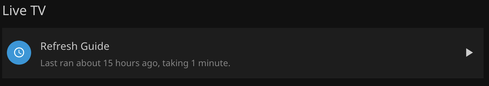

# Live TV Guide Data not up to date

Use Remote Desktop to connect to the computer:

Ensure that the Docker Container is healthy and running
Open Docker Desktop, restart the container

If the container will not run, delete and recreate the Container per [Live TV Configuration](/server-apps/jellyfin/#live-tv-configuration) setup instructions

If container is setup, running, and healthy:
Open the file `/Users/Shared/xmltvdata/xmltv.xml` with a text editor and see if the file has up to date data.

Find the start of the `<programme></programme>` block (around line 500), and see that it has data similar to
``` xml
<programme start="YYYYMMDD090000 +0000" stop="YYYYMMDD100000 +0000" channel="I2.1.21634.zap2it.com"> 
```

If the file does have up to date data but Jellyfin does not have updated data:
Open Jellyfin Admin Dashboard (web console) -> Live TV and ensure file is listed under `TV Guide Data Providers`
{: style="height:100px;width:500px"}

If the file is listed:
Ensure that the Scheduled Task Live TV / Refresh Guide has run recently, and is scheduled to run at least every 12 hours (11am/11pm)
{: style="height:100px;width:500px"}
