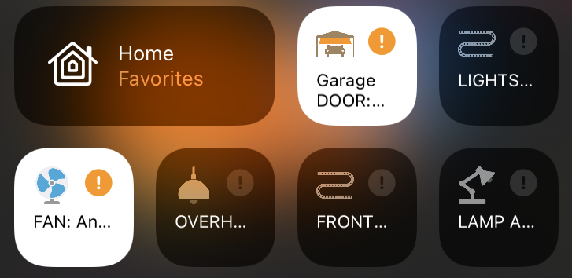

# Smart Devices showing as “No Response”/Orange Exclamation mark in Apple Home

{: style="height:150px;width:300px"}

This is usually caused by your device, not MacServer. Try rebooting your device. 

If it still shows an issue, check that [HomeBridge](../server-apps/homebridge.md#usage) (plugs, garage door) or Scrypted (camera) are online and aren’t throwing any errors.

If issues persist, [Reboot MacServer](reboot.md)