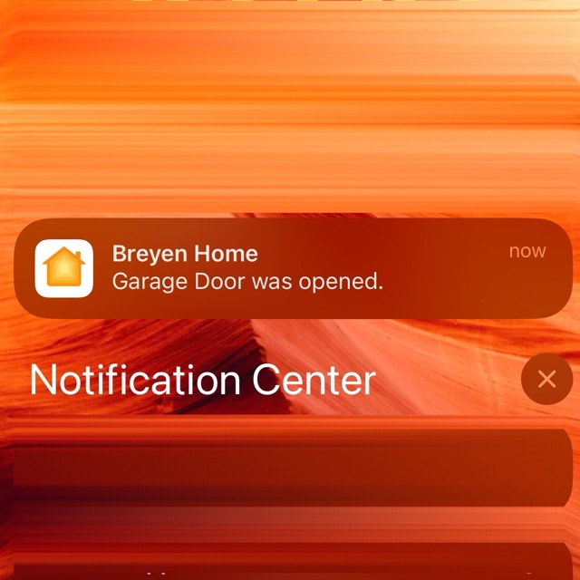
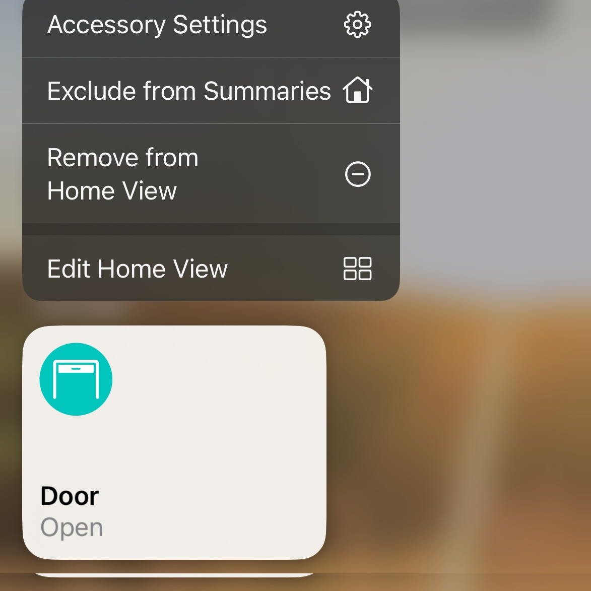
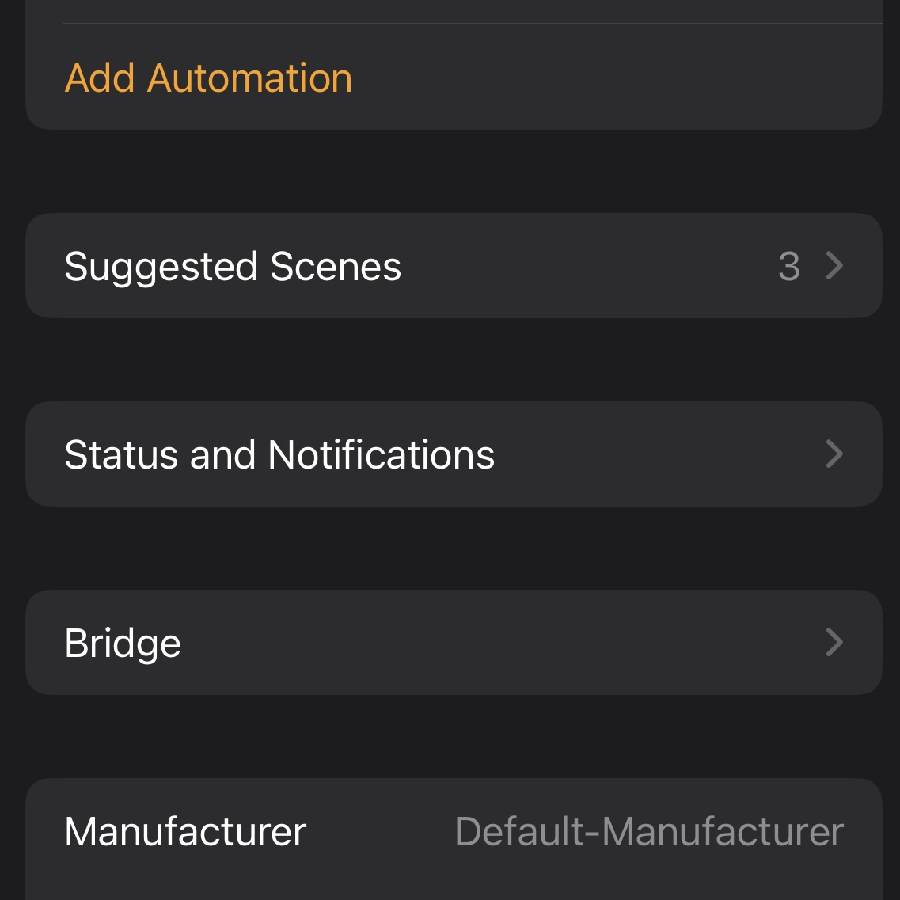
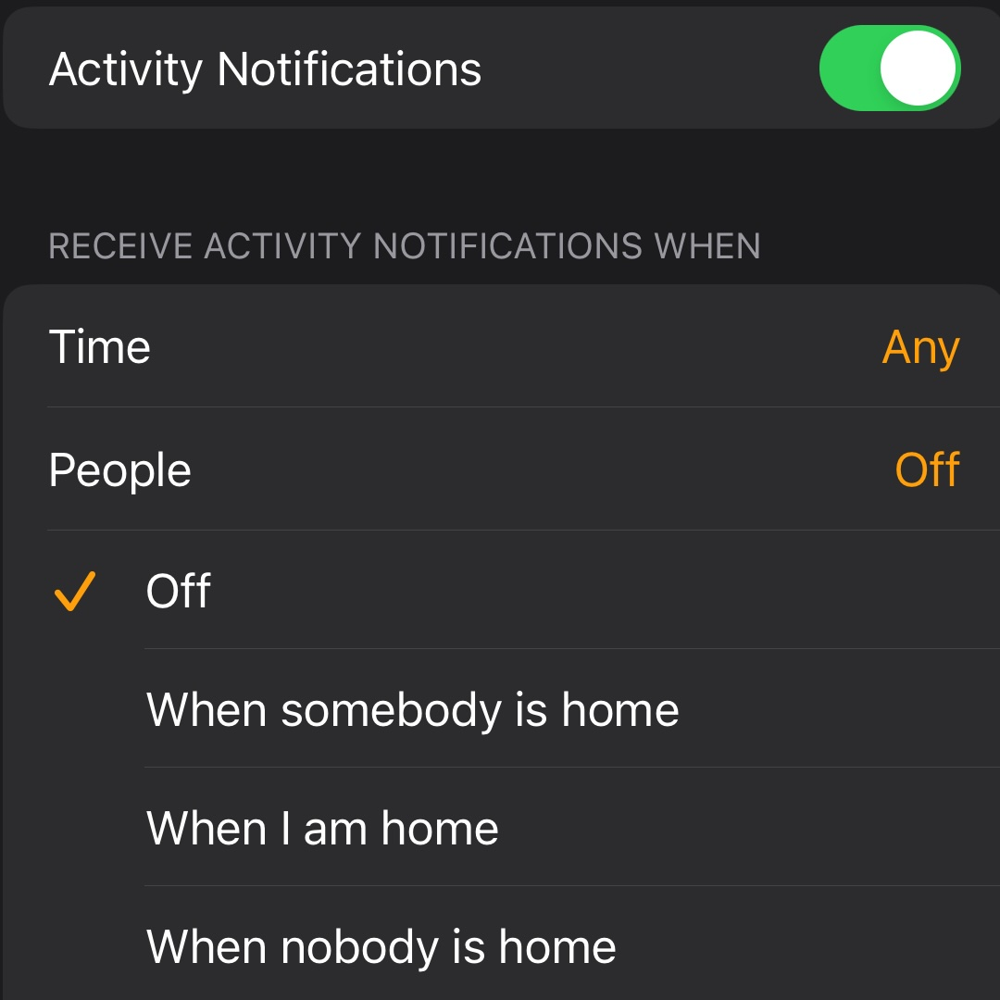

# iOS Garage Door Notifications

!!! info " "
    By default, iOS sends notifications anytime the garage door is opened or closed. You can modify this to send notifications only when you are at home, or only when you are away, etc.

1. Click on the notification or open the Home App
2. Long press on 'Garage Door' and choose 'Accessory Settings'
3. Scroll to 'Status and Notifications'
4. Modify settings as needed

 ''            |  ''
:-------------------------:|:-------------------------:
{: style="width:200px"} |  {: style="width:200px"}
{: style="width:200px"} |  {: style="width:200px"}